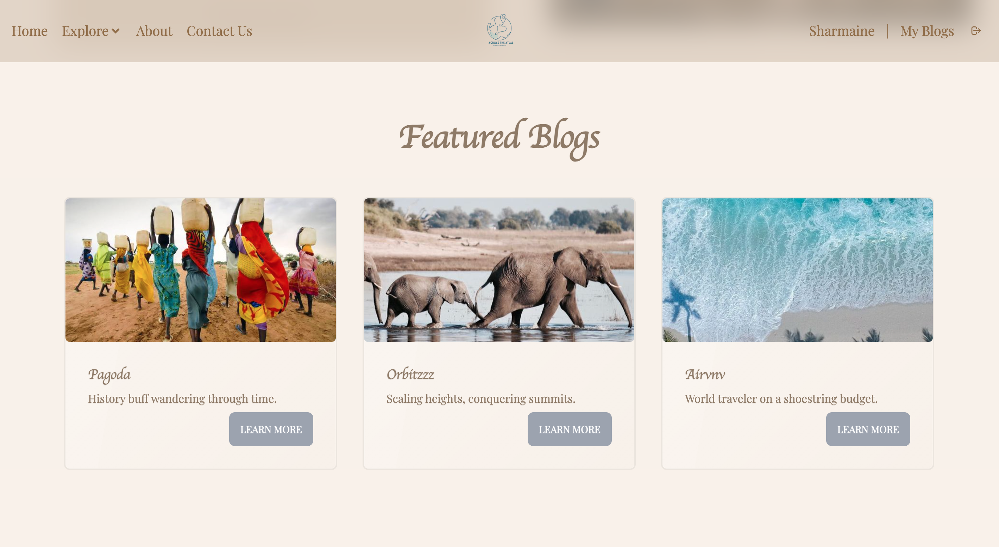
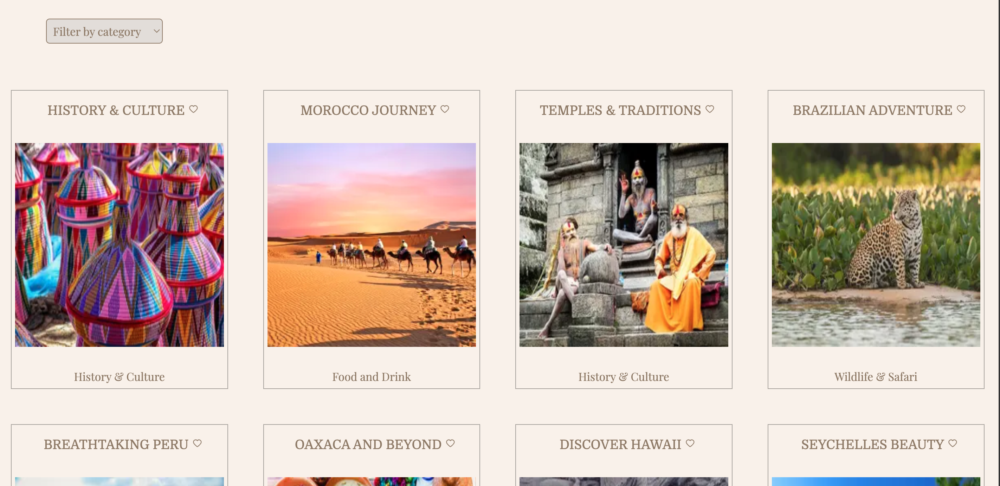
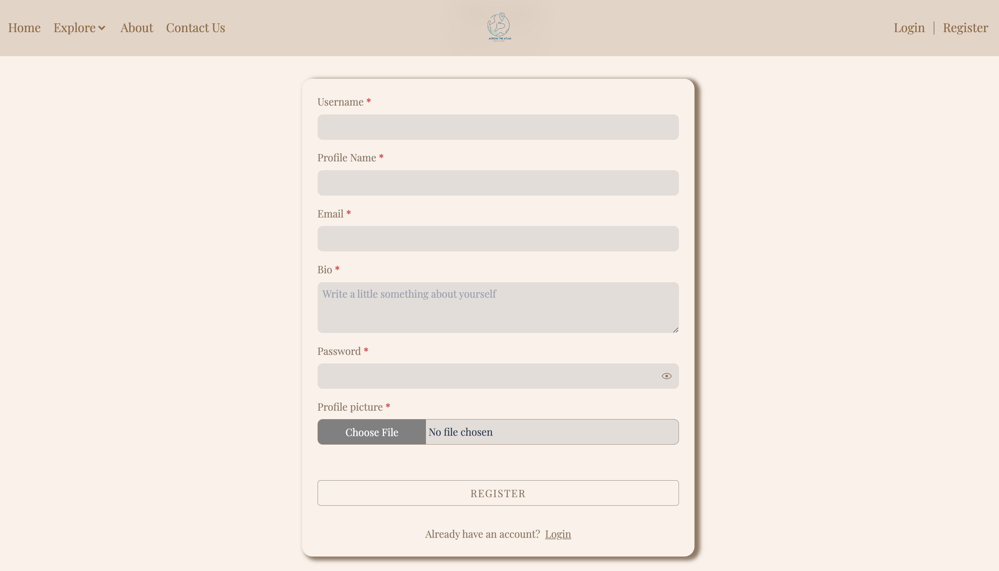
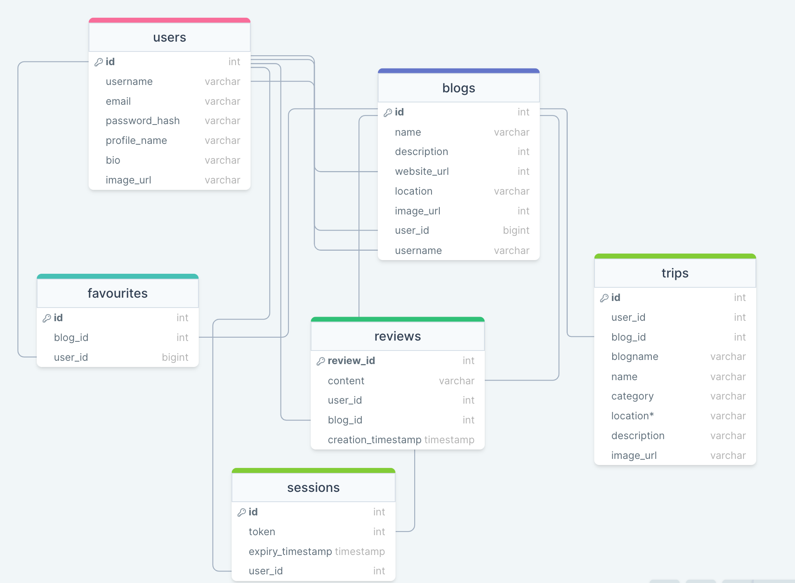
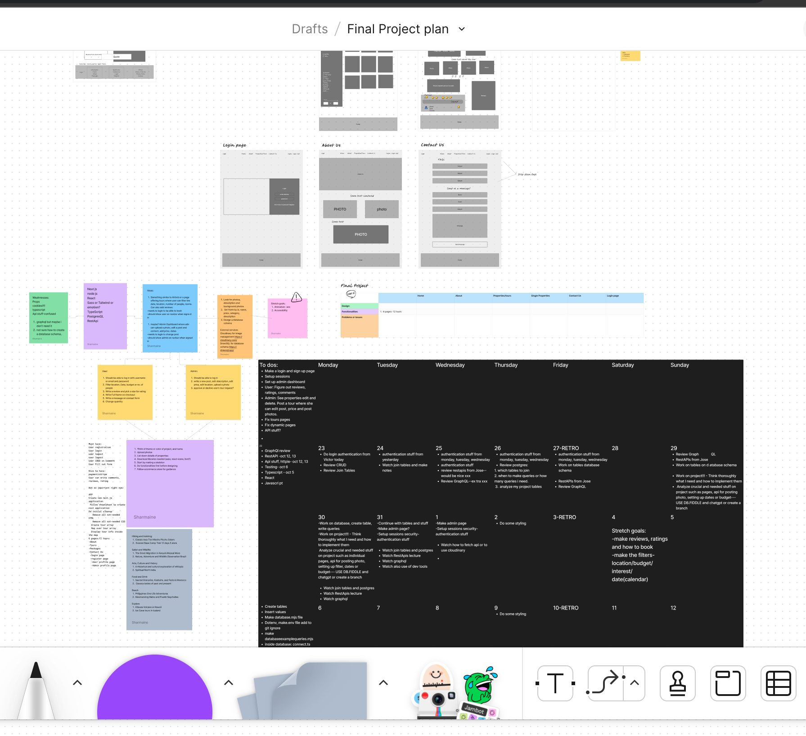

<h1 align="left">Across the Atlas</h1>

###

Across the Atlas is a travel blog dedicated to fostering a community of passionate travelers. This platform enables users to share their own travel photos, experiences, and engage in thoughtful discussions through comments.

###

<h2 align="left">Key Features</h2>

###

- Robust user authentication and authorization system - Empower users to craft personalized blog posts - Seamless creation of trip entries within blog posts - Enable community members to share and receive reviews - Effortless photo uploads for blog posts, trip entries, and user profiles - Intuitive functionality for liking and favoriting blogs or trips, allowing users to curate their saved content on their profiles.

###

<h2 align="left">Technologies Used:</h2>

###

  
  
  
  
  
  
  
  
  
  
  
  
  
  
  
  
  
  
  
  
  
  
  
  
  
  
  

###

<h2 align="left">Screenshots</h2>

###

<h2 align="left">Prototype and Wireframing:</h2>

###
